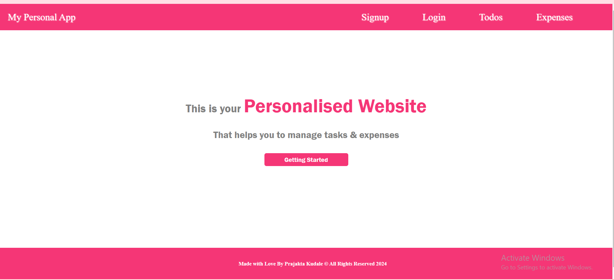
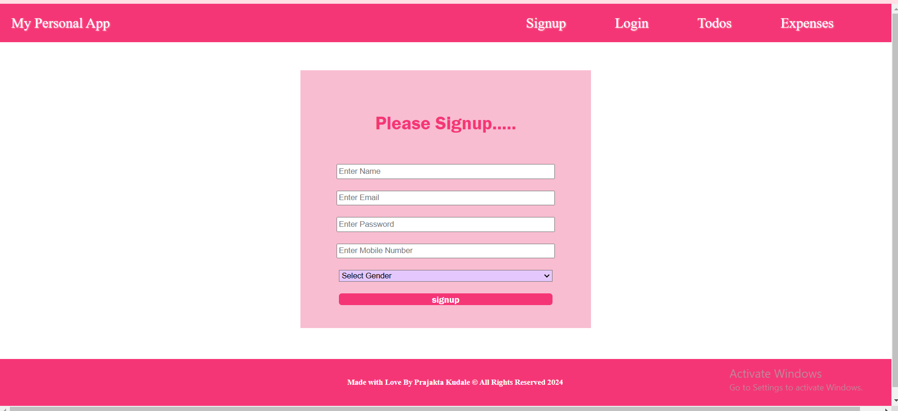
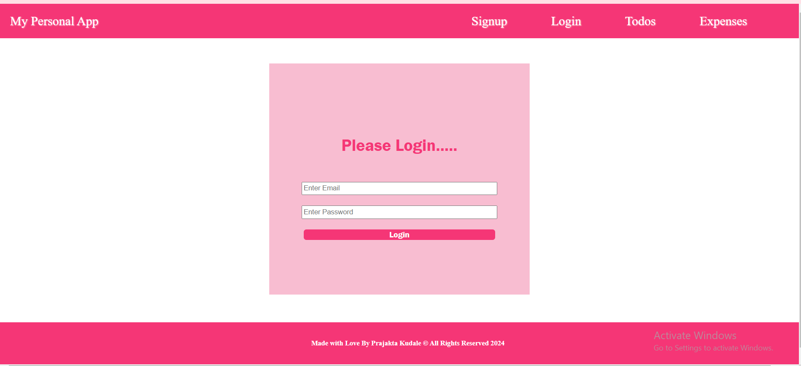
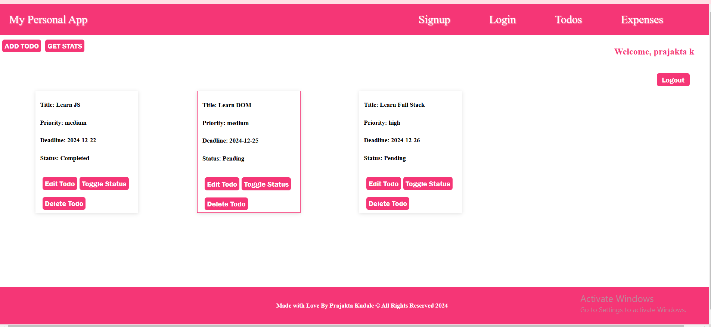
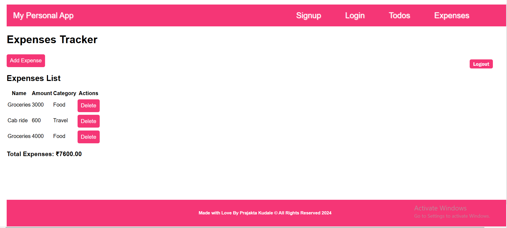

# Mini-TODO-App
### Project Name: Personal Todo & Expenses App

#### This app helps to you track and maintain your Todos & Expenses

#### Tech Stack Used: HTML/CSS/JS

### Features working: Login/Logout, All the CRUD Operations of Todos

### Deployed FronrEnd Link: [link](https://abvenu.github.io/empowerherfullstack/)

### Deployed Backend Link: [Link](https://beryl-ember-havarti.glitch.me)

### Screenshots:

1. #### Home Page: 

2. #### SingUp Page: 

3. #### Login Page:  

4. #### Todo Page:  

5. #### Expenses Page:  